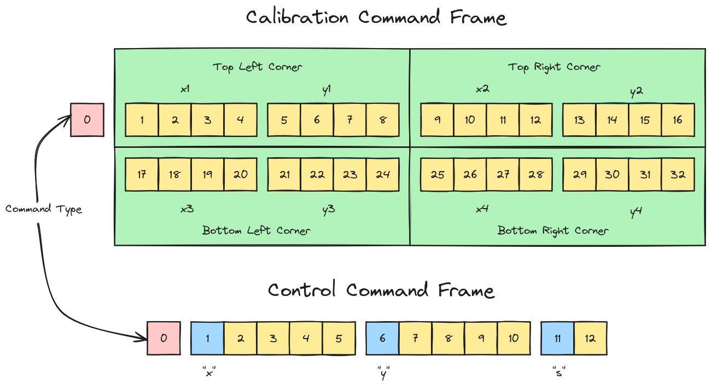

# Laser Arm Contoller

This program is made to control an aimable laser with a Raspberry Pi. It is
meant to be run as a privileged user in order to easily access the GPIO pins on
the Raspberry Pi OS, which requires `root` privileges or some extra group 
permission configuration or something. I figure it's better to have a program
with very limited functionality running with `root` privileges rather than
give an entire application that clients can potentially connect to via the
internet `root` privileges.

The program contains a simple socket server and a GPIO controller:

## Server

The server component listens on a Unix Domain socket for command frames of two varieties, calibration command frames and control command frames.

### Calibration Command Frame

The calibration command frame is used to pass the coordinates of the arm in each corner of the users view window. The controller uses these corner coordinates to adjust the movements of the arm to be more consistent with the view window. The calibration command frame starts with a single byte that declares the command frame type. The rest of the bytes in the command frame are the 32-bit float coordinates of each of the corners in order:

1. Top left
2. Top right
3. Bottom right
4. Bottom left

**Calibration Command Frame Structure:**

Byte(s) | Value
--|--
`0` | Command Frame type
`1-4` | Top left corner `x` coordinate
`5-8` | Top left corner `y` coordinate
`9-12` | Top right corner `x` coordinate
`13-16` | Top right corner `y` coordinate
`17-20` | Bottom right corner `x` coordinate
`21-24` | Bottom right corner `y` coordinate
`25-28` | Bottom left corner `x` coordinate
`29-32` | Bottom left corner `y` coordinate

### Control Command Frame

The control command frame is essentially a simple binary list of key-value pair. The first byte of the frame declares the command frame type and the subsequent bytes are key-value pairs:

**Keys**
Key | Type | Value
--|--|--
`"x"` | `float` | `x` rotation of the laser arm
`"y"` | `float` | `y` rotation of the laser arm
`"s"` | `char / bool` | `laser` on or off

** Control Command Frame Structure:

Byte(s) | Value
--|--
`0` | Command Frame type
`1` | Key (ex. `"x"`)
`2-5` | Float value
`6` | Key (ex. `"y"`)
`7-10` | Float value

## Controller

The laser arm is controlled using [PiGPIO](https://github.com/fivdi/pigpio) to
set the X and Y position of the arm and the power state of the laser on the arm.

